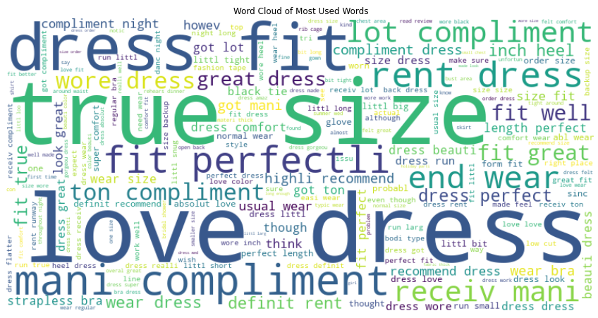

# Dsc-PT04-Phase-4-Project
Fashion Clothing Recommender System
# Fashion Clothing Recommender System ✨

Project Extravaganza

Welcome to the thrilling world of FashionFab Recommender Bonanza! Meet our sensational team: Onesphoro Kibunja, the Stylish Sorcerer; Bernadette Wanjiku Nganga, the Trendsetter Extraordinaire; and Caleb Ochieng, the Fashion Maestro! Together, we're on a mission to revolutionize your wardrobe with the most dazzling, jaw-dropping fashion picks!

Objectives
1. Develop a Recommender System
The primary goal is to create a dynamic engine that evolves with user feedback, providing tailored fashion recommendations. The project employs collaborative filtering techniques, including SVD and ALS, to enhance the customer experience on the RentTheRunway platform.

2. Improve Shopping Experience
By offering personalized recommendations, the project aims to significantly improve the overall shopping experience. Personalization is expected to increase user satisfaction, loyalty, and, consequently, boost revenue for fashion retailers.

3. Identify Trends in Customer Choices
Through exploratory data analysis, the project seeks to uncover underlying trends in customer choices. This includes analyzing the distribution of rented items for different occasions such as weddings, formal affairs, and parties.

4. Understand People's Physical Features
The project delves into the dataset to understand users' physical features, such as body type, bust size, height, weight, and age. This information is crucial for guiding recommendations and ensuring the clothing fits well.

Key Features
- Dataset Analysis
The project explores a Rent the Runway dataset consisting of 192,544 rows and 15 columns. Key columns include user-related details, item information, and features for sentiment analysis.

- Collaborative Filtering with SVD
Utilizing the Surprise library, the project implements collaborative filtering with SVD. Sentiment analysis is incorporated to create hybrid ratings, providing a nuanced approach to user satisfaction.

- ALS Model Exploration
The project extends its collaborative filtering exploration with the ALS optimization approach. ALS is particularly beneficial for scenarios with sparse data, contributing to efficient parallelization and handling of missing values.

- Trend Analysis
Exploratory data analysis includes the identification of trends in customer choices for various occasions. The team examines the distribution of rented items to gain insights into customer preferences.

- Consideration of Physical Features
The project considers a range of physical features, including body type, bust size, height, weight, and age. This information contributes to a more comprehensive understanding of user preferences and enhances the recommendation engine.

Recommendations

To further enhance the Fashion Clothing Recommender System, the following recommendations are proposed:

A) Solicit user input: Encourage users to share their thoughts on suggested outfits. This user feedback is crucial for refining the recommendation system and gaining insights into user preferences.

B) Maintain real-time oversight: Establish mechanisms for ongoing monitoring and updates to ensure the system stays current with evolving customer preferences.

C) Form partnerships with fashion influencers: Consider collaborating with fashion influencers to promote the recommendation system and gain valuable insights into emerging fashion trends. This collaboration can also boost the system's visibility and user adoption.

D) Develop a mobile application: Expand the recommendation system to a mobile app, providing users with a seamless and personalized shopping experience on their mobile devices. Enabling mobile accessibility can significantly elevate user engagement.

Limitations
- Sparse Data Issues
Collaborative filtering models may face challenges with sparse data, impacting the accuracy of predictions, particularly for users or items with limited interaction history.

- Dependency on Explicit Ratings
The model heavily relies on explicit user ratings, and a lack of diversity in ratings may limit the system's ability to capture comprehensive user preferences.

- Limited Exploration of Trends
While trends are explored, additional analysis, including seasonal trends and evolving customer behaviors, could provide a more nuanced understanding of user preferences.

Conclusion

The Fashion Clothing Recommender System project successfully delivers a functional recommendation engine, incorporating both SVD and ALS approaches. The team's focus on enhancing the shopping experience, understanding customer preferences, and considering physical features lays a solid foundation for ongoing improvements. Continuous monitoring, adaptation to trends, and user feedback will be crucial for refining the system and staying competitive in the dynamic fashion industry.

Note: This detailed README provides an in-depth overview of the Fashion Clothing Recommender System project.
